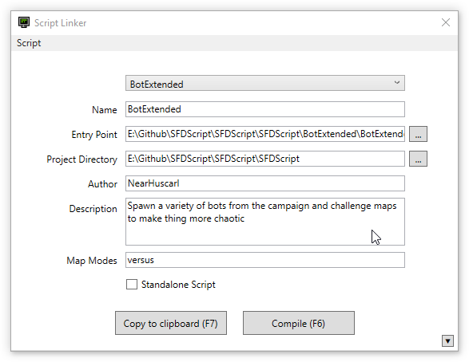

# Script Linker

Script Linker is a helper program for [Superfighters Deluxe] (SFD) to help ease the process of scripting.

Currently, to script in SFD, you have to code in a built-in text editor that is basically a text area with a compile button which make scripting so much of a pain that only masochists will use said editor.

If you want to write anything more than a couple of classes, you should use Visual Studio/Vscode instead as it supports syntax highlighting, autocomplete, shortcuts like jump into file, see references...

Script Linker tries to smooth the process of using both tools: An IDE (for coding) and the SFD text editor (for compiling). Remove the unnecessary metal load to help scripters write more quality scripts



## Features

* Manage your scripts: Add, edit, search and remove script info (Do not have support for `sfde` files)
* Populate new script with game script template (template can be changed in `ScriptTemplate.txt`)
* Organize code in multiple files and folders
* Automate the compiling task via a global hotkey
* Generate output file to SFD script folder
* Place breakpoints directly in Visual Studio instead of having to write `System.Diagnostics.Debugger.Break();` in your script *(Experimental)*

*Note*: after placing breakpoints, you have to hit Save All (<kbd>Ctrl</kbd>+<kbd>Shift</kbd>+<kbd>S</kbd>) in Visual Studio to save the .suo file which stores all breakpoints info

## Download

Download [here](https://github.com/NearHuscarl/ScriptLinker/releases) (ScriptLinker.zip)

## Sample projects

* [BotExtended]

## Development

For anyone wondering why I dont have any Notification calls inside the properties from the ViewModel like this:

```C#
private string copyToClipboardHotkeyName;
public string CopyToClipboardHotkeyName
{
    get { return copyToClipboardHotkeyName; }
    set { SetPropertyAndNotify(ref copyToClipboardHotkeyName, value); }
}
```

but just the shorthand auto property

```C#
public string CopyToClipboardHotkeyName { get; set; }
```

That's because I'm using this awesome Fody plugin [PropertyChanged] which help you cut down the verbose part when declaring binding property in WPF

## Guides

* [Set up Visual Studio]


[Superfighters Deluxe]: https://mythologicinteractive.com/SuperfightersDeluxe
[BotExtended]: https://github.com/NearHuscarl/BotExtended
[PropertyChanged]: https://github.com/Fody/PropertyChanged
[Set up Visual Studio]: https://www.mythologicinteractiveforums.com/viewtopic.php?f=15&t=1588
