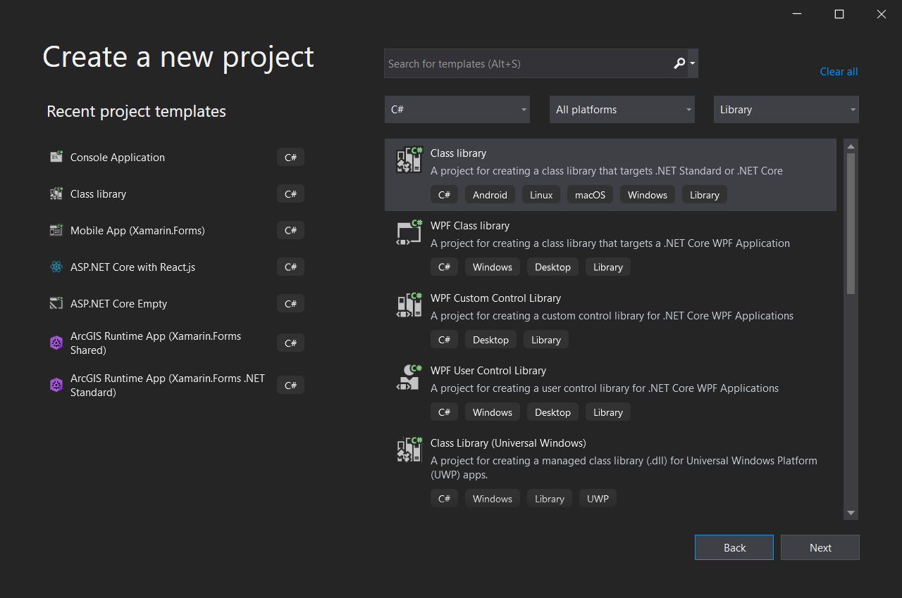
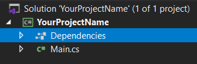
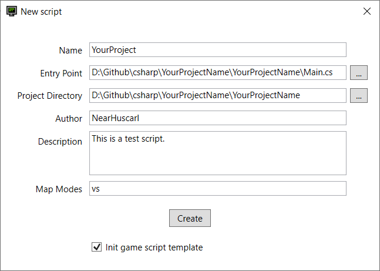
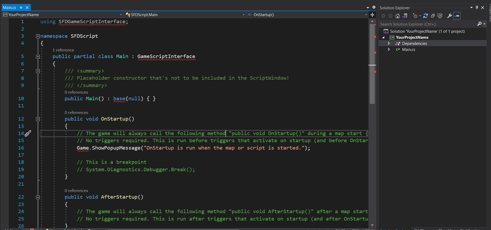
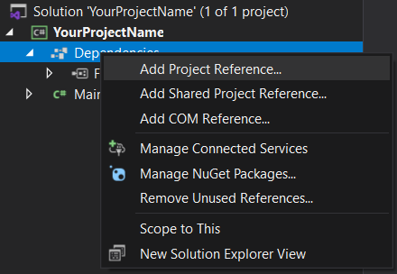
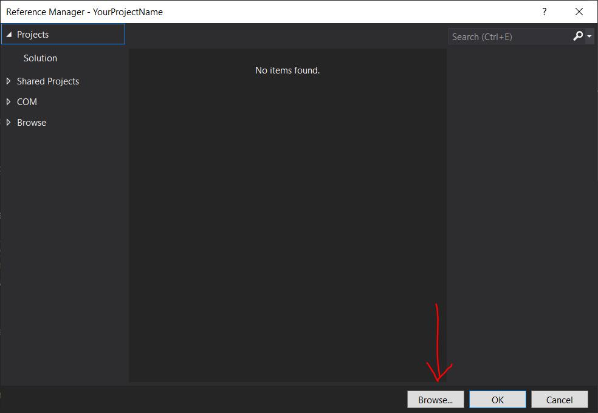

# Script Linker

Script Linker is a helper program for [Superfighters Deluxe] (SFD) to help ease the process of scripting.

Currently, to script in SFD, you have to code in a built-in text editor that is basically a text area with a compile button which make scripting so much of a pain that only masochists will use said editor.

If you want to write anything more than a couple of classes, you should use Visual Studio/Vscode instead as it supports syntax highlighting, autocomplete, shortcuts like jump into file, see references...

Script Linker tries to smooth the process of using both tools: An IDE (for coding) and the SFD text editor (for compiling). Remove the unnecessary metal load to help scripters write more quality scripts

https://user-images.githubusercontent.com/23303775/162793252-f7ba9685-7830-4404-a812-8bfb4b2699c0.mp4

## Features

* Manage your scripts: Add, edit, search and remove script info (`sfde` files are not supported).
* Populate new script with game script template (template can be changed in `ScriptTemplate.txt`)
* Organize your code in multiple files and folders
* Automate the compiling task via a global hotkey
* Generate output file to SFD script folder.

## Usage

- Create a new project in Visual Studio.



- Rename the default `Class1.cs` file to `Main.cs` (or something more meaningful).



- Open ScriptLinker. Select `Script` > `New`.


- Fill in the script detail:
    - **Name**: *(Required)* Your script name. This field must be unique between scripts.
    - **Entry Point**: *(Required)* The main file where you have the `GameScript` lifecycles like `OnStartup` or `OnUpdate`.
    - **Project Directory**: *(Required)* The directory containing the `*.csproj` file.
    - **Author**: Self-explanatory
    - **Description**: Self-explanatory
    - **Map Modes**: versus, custom, survival or campaign. This is my bad, I should have made a combobox.
    - **Init game script template**: Initialize the Entry Point file with a starting template. The template can be modified in `ScriptTemplate.txt` 



- In your IDE, the `Main.cs` file now should look like this:



- To fix the error, add the `SFD.GameScriptInterface` assembly. Right click `Dependencies` > `Add Project Preference...` > `Browse`

<div>
    
    
</div>

- Find and select the `SFD.GameScriptInterface.dll` file. It's in where the game is installed > Click `OK` to confirm.

- Go to the Map Editor and make sure the Script tab is opened so the code can be pasted from the IDE.

You're pretty much done here. Now you can develop your script in Visual Studio and enjoy all of the IDE features like syntax highlighting, intellisense, codelen... You can also create multiple files and directories to orgnaize your code however you want, Note that cross project import is not supported.

Once you edit your code, hit **F8** to compile. This shortcut can be changed in the settings (`Tools` > `Option`). You can see a short demo [here](https://youtu.be/q3M2rQQSNU4).

*Tip*: When you reference the `IGame` instance outside of the `GameScriptInterface` subclass, the IDE will complain that the `Game` property does not exist. To work around it, create a helper class with the same property name and type:

```c#
using SFDGameScriptInterface;

namespace YourProjectName
{
    public static class GameScriptUtil
    {
        public static readonly IGame Game;
    }
}
```

Then import the class in your file to make the member `Game` available in the scope: 

```c#
using static YourProjectName.GameScriptUtil;

namespace YourProjectName.MyLib
{
    public static class Library
    {
        public static IEnumerable<IPlayer> GetAlivePlayers()
        {
            // Game is available here
            return Game.GetPlayers().Where(p => !p.IsDead);
        }
    }
}
```

## Download

Download [here](https://github.com/NearHuscarl/ScriptLinker/releases) (ScriptLinker.zip)

## Sample projects

* [BotExtended]

## Development

For anyone wondering why I dont have any Notification calls inside the properties from the ViewModel like this:

```C#
private string copyToClipboardHotkeyName;
public string CopyToClipboardHotkeyName
{
    get { return copyToClipboardHotkeyName; }
    set { SetPropertyAndNotify(ref copyToClipboardHotkeyName, value); }
}
```

but just the shorthand auto property

```C#
public string CopyToClipboardHotkeyName { get; set; }
```

That's because I'm using this awesome Fody plugin [PropertyChanged] which help you cut down the verbose part when declaring binding property in WPF

## Guides

* [Set up Visual Studio]


[Superfighters Deluxe]: https://mythologicinteractive.com/SuperfightersDeluxe
[BotExtended]: https://github.com/NearHuscarl/BotExtended
[PropertyChanged]: https://github.com/Fody/PropertyChanged
[Set up Visual Studio]: https://www.mythologicinteractiveforums.com/viewtopic.php?f=15&t=1588
